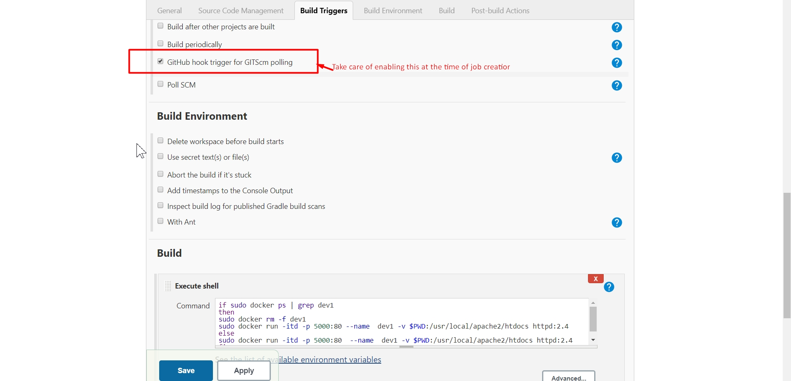
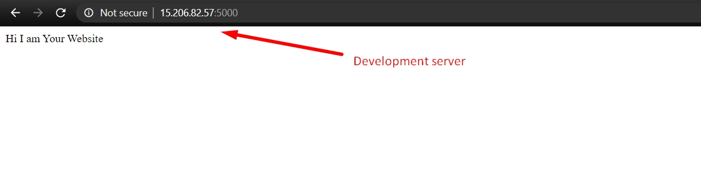

# DevOps-Pipeline
DevOps pipeline for creating development and production deployment using Jenkins and Docker

## Prerequsite
* Installed Jenkins, git and Docker in server
* Setup jenkins for creating new job
* check docker service

## Need Of DevOps
* Shorter Development Cycles, Faster Innovation
* Reduce Implementation Failure, Reflections and Recovery Time
* Better Communication and Cooperation
* Greater Competencies
* Reduce Costs and IT Staff

## Problems In Organizations
* Manually creating staging/devlopment server for testing and final approval for production.
* Then again manually creating production server that is too much time consuming as well as have chances of human mistakes. (Increased Release cycle)
* Configuring server manually consuming too much man power and not efficient
* Every time new feature developed required to manually deploy on development server where manually testing will be done then again all this setup will manually done on production. overall dev team has to depend on operation team and if any bug reported in testing then this process has to be start again after bug fixing.

## Solution to this problems
* We need a job which automatically pulling data whenever developer push to scm(Source code management). After pulling data from scm job should create deployment server, configure it and setup the application automatically.  
* Job will first configure developemt server and It will waits for approval from management or test tool. (It varies in organizations) After approval it will do same configuration in Production server.

## What we need
* One jenkins server and portal (Recommended: Setup on centos8)
* one github repository

# Let's Start
* First We will clone our github repository in our local system
 

* Now I am assuming you all know how to use git so i'm skipping branch creation and pushing changes to github.
* Now let's Jump on Jenkins portal to create our first job. Please install git and github plugin in jenkins (GO TO MANAGE JENKINS AND MANAGE PLUGINS)

* Here we are creating our first job and telling my job that this is link of my github repository you have to go there and find my code your own.
* Use branch: dev (For cloning dev branch)

* Now Here we are using docker to deploy over server this code will create docker container for us (If not understood try some googling)

`if sudo docker ps | grep dev1
 then
 sudo docker rm -f dev1
 sudo docker run -itd -p 5000:80 --name  dev1 -v $PWD:/usr/local/apache2/htdocs httpd:2.4
 else
 sudo docker run -itd -p 5000:80  --name  dev1 -v $PWD:/usr/local/apache2/htdocs httpd:2.4
 fi
` 

* This Code has to be run by our job then it will create docker conatiner in our local server

* Now build this job and go to your local server ip and see on port 5000 (Congratulations for your first JOB build)

## Now the Important Part comes

* We will create job2 that will be manually builded by us after manual testing of developement server
* Check this setup.

## Let's create our final job that will pull data from master branch and deploy on production server.

* It will be same as development job only change is branch_name

* Well that all you have to do. 

## check your development server and prodcution server on port 5000 and 5001

development server

Production server

# Important Note:

## Don't Forget to gave jenkins user sudo power 
## Apply github hook on repository

